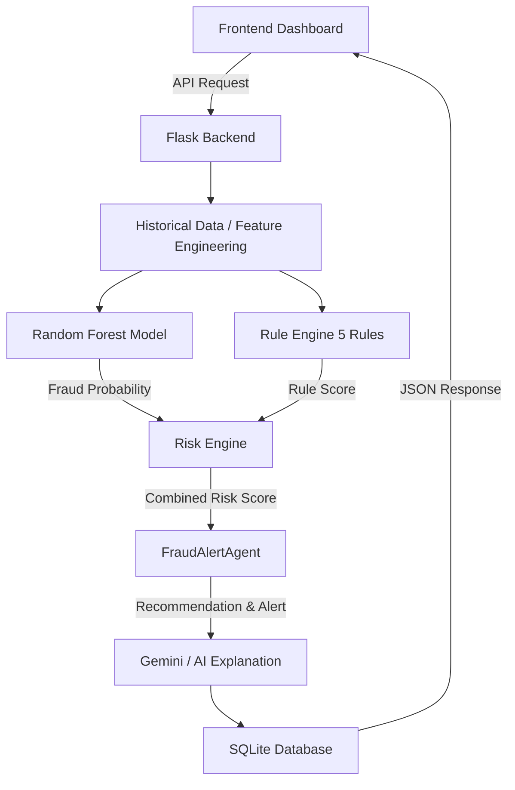

# FraudGuard Architecture

## System Flow

The Fraud Transaction Alert Agent operates as a multi-layered pipeline to analyze simulated financial transactions and flag suspicious activities.

### 1. Frontend (UI)
- **Role**: Simple, dynamic dashboard to monitor real-time insights.
- **Components**: Overview statistics, Analyze transaction form, Risk Analytics, Model Settings.
- **Technology**: Vanilla HTML/JS/CSS to ensure low footprint without unnecessary framework overhead.

### 2. Backend (API Layer)
- **Role**: The main integration layer. 
- **Components**: Flask REST API handling data processing and orchestration. 
- **Core Endpoints**: `/api/analyze`, `/api/overview`, `/api/transactions`, `/api/model-metrics`, `/api/demo-transactions`.

### 3. Historical Data & Feature Engineering
- **Role**: Prevents data leakage by computing statistical features strictly using transactions occurring *before* the current timestamp.
- **Implementation**: Computes rolling windows (1-day, 7-day, 30-day) for customer averages and terminal risk scores.

### 4. Random Forest Model
- **Role**: The ML classifier component.
- **Logic**: Trained on the transformed "Fraud Detection Handbook" dataset. Produces a continuous fraud probability (0-100%).

### 5. Rule Engine
- **Role**: Deterministic checks representing classical banking controls.
- **Logic**: Evaluates 5 core rules (High amount deviation, high velocity, night transaction, historical terminal risk, behavioral anomaly) and produces a score out of 70.

### 6. Risk Engine
- **Role**: Fuses ML and Rule logic.
- **Logic**: Weights ML (50%) and Rules (50%) to output a final 0-100 Risk Score. Sets a Risk Level (LOW, MEDIUM, HIGH, CRITICAL).

### 7. FraudAlertAgent
- **Role**: The core orchestration decision layer.
- **Logic**: It looks at the risk score and rule explanations to decide the ultimate action (e.g., "ALLOW", "MONITOR", "REVIEW", "ESCALATE"). It determines if an "Alert" needs to be sent to human analysts.

### 8. Explanation Layer (Gemini)
- **Role**: Converts the structured deterministic reasons into a concise, professional paragraph for an analyst to read.
- **Logic**: It does *not* invent facts or change scores. If the API is unavailable, the Agent gracefully falls back to a deterministic text explanation.

### 9. Database (SQLite)
- **Role**: Persists transaction analysis history and alert status for dashboard retrieval.
- **Constraint**: SQLite is used for this prototype but would need to be migrated to a standalone relational DB (like PostgreSQL) if deployed to a serverless or ephemeral container environment.
